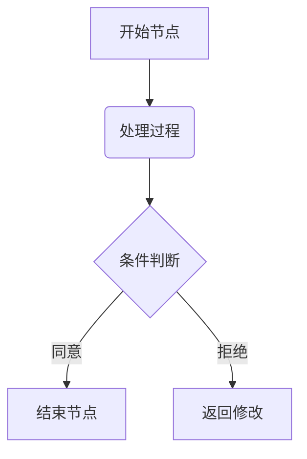

# FFM 基础语法

如果你已经熟悉基础的 Markdown，那么你几乎已经掌握了 FFM 的 90%。本章节将带你快速了解 FFM 支持的标准基础语法。

## 标题

在 FFM 中，撰写标题的唯一合法语法是使用 `#`。`#` 的数量（1-6 个）对应 1 到 6 级标题。

```markdown
# 一级标题

## 二级标题

### 三级标题

#### 四级标题

##### 五级标题

###### 六级标题
```

```quote
**注意**：

`#` 符号必须在行首，并且后面**必须保留一个空格**。

FFM 不支持 `===` 或 `---` 放置在文本下方的旧式标题语法。
```

## 文本强调

要将文本设置为**粗体**，请将其用两个星号括起来：

```markdown
这是**粗体文本**。
```

要将文本设置为*斜体*，请将其用单个星号括起来：

```markdown
这是*斜体文本*。
```

要将文本设置为***粗体和斜体***，请将其用三个星号括起来：

```markdown
这是**粗体文本**。
```

使用两个连字符 `--` 包裹以在文本上添加--删除线--：

```markdown
这是--被删除的内容--。
```

使用两个下划线 `__` 包裹以在文本上添加底线，以强调内容：

```markdown
这是**被划线的内容，通常代表总结性结论**。
```

## 列表

FFM 支持无序列表和有序列表。无序列表推荐统一使用 `-` 符号；通过在前面添加 2 个空格的缩进创建子列表：

```markdown
- 第一项
  - 嵌套的子项 1
    - 三级列表
    - 三级列表
  - 嵌套的子项 2
- 第二项
- 第三项
```

有序列表直接使用数字及**半角**点号 `.` 开头：

```markdown
1. 第一项
2. 第二项
3. 第三项
```

## 链接与图片

插入链接和图片的方式非常直观，图片的语法仅仅比链接多了一个 `!`。

```markdown
欢迎访问 [Ф social](https://www.fuyeor.com)。


```

```quote
**注意**：因为安全性问题，并非所有平台都支持图片嵌入。
```

## 引用块

当你需要引用他人的话或者突出某段说明时，可以使用 `>` 符号：

```markdown
> “生存还是毁灭，这是一个值得考虑的问题。”
>
> ——《哈姆雷特》
```

此外，也可以用代码块引用多行内容：

````markdown
```quote
“生存还是毁灭，这是一个值得考虑的问题。”

——《哈姆雷特》
```
````

## 代码相关

如果要在 Markdown 中表示代码，通常分为行内代码（inline code）和代码块（code block）。

### 行内代码

对于行内代码，使用反引号 `` ` `` 包裹，例如：

```markdown
在 JavaScript 中声明常量的方式是：`const name = "Fuyeor"`
```

如果行内代码里包含反引号，则使用两个反引号包裹，例如：

```markdown
在 Fer 中声明常量的方式是：`` name = `Fuyeor` ``
```

### 代码块

使用三个反引号 ` ``` ` 表示代码块，并推荐在开头注明语言名称，以便渲染时提供完美的语法高亮：

````markdown
你可以通过如下方式在 TypeScript 中声明函数：

```typescript
function sayHello() {
  console.log('Hello, Fuyeor!');
}
```
````

代码块可以嵌套。如果要在代码块中表示代码块，请在外层使用更多的反引号：

`````markdown
在 FFM 中使用如下语法创建 accordion：

````markdown
```accordion
**标题或步骤**

段落内容
```
````
`````

## 其他 FFM 特有语法

FFM 目前支持 slide、chain、accordion 语法。它们均以代码块包裹。

### slide

slide（滑块）推荐用于长度相似、用于并列对比的项目。它使用分割线语法 `---` 切分区块：

````markdown
以下是各社交媒体的比较：

```slide
**Ф social**
- 字数限制：3000 - 5000（字符数）
- 内容格式：Fuyeor Flavored Markdown

---

**Bluesky**
- 字数限制：300（字符数）
- 内容格式：纯文本

---

**Mastodon**
- 字数限制：视实例而不同，但大多数实例为默认的 500
- 内容格式：纯文本
```
````

> **注意**：`---` 的前后必须有换行。

### chain

chain（思维链）推荐用于诸如 FAQ、思考步骤、时间轴、任务列表、教程步骤等场景。

它使用独占一行的粗体语法（`**`）创建标题节点。以下是作为时间轴的示例：

````markdown
互联网从军用实验网络到全球互联，再到人人皆可参与的信息时代，经过如下发展：

```chain
**1960 年代：概念与雏形**
美国国防部提出“阿帕网”（ARPANET）概念，旨在建立一个分散、即使部分节点被摧毁也能继续通信的网络。

**1970-1980 年代：技术奠基**
TCP/IP 协议诞生，确立了计算机互相通信的通用语言，互联网的雏形逐渐形成。

**1990 年代：万维网与普及**
万维网（WWW）的出现让网页变得可浏览。互联网正式向公众开放，进入大规模商业化和大众化阶段。

**2000-2010 年代：蓬勃发展**
论坛、博客、社交媒体兴起。智能手机的普及让互联网真正装进了人们的口袋，随时随地都能上网。

**现在：智能互联**
全面迈入移动互联网、物联网、大数据和人工智能深度融合的时代。
```
````

在标题中，支持 Markdown 任务列表语法。例如：

- `**[x] 标题**` 会渲染为该标题已完成的样式（绿色节点）
- `**[ ] 标题**` 会渲染为该标题未完成的样式（黄色节点）
- `**标题**` 会渲染为默认样式（通常是紫色节点）

以下是用作任务列表的示例：

````markdown
周末朋友生日派对的筹备进度：

```chain
**[x] 第一步：定好聚会场地**
已经预订好了大家一致同意的桌游店，定金也付过了。

**[x] 第二步：统计当天到场人数**
群聊里大家都接龙完毕，总共有 8 个人参加。

**[ ] 第三步：买好零食和饮料**
列好了购物清单，打算周六早上买完直接带去店里。

**[ ] 第四步：准备神秘生日礼物**
网购的礼物还在路上，预计周五下午送到。
```
````

同时，它也非常适合用来写简单的操作指南。以下是作为操作指南的示例：

````markdown
如何给自己冲泡一杯香浓的挂耳咖啡：

```chain
**撕开滤袋**
沿着包装上的虚线小心撕开，并把两侧的纸质“耳朵”牢牢挂在杯沿上。

**第一次注水焖蒸**
用热水轻轻打湿咖啡粉，静置 20 秒，这时候能闻到浓郁的咖啡香气。

**分次注水完成**
继续缓慢倒入热水，直到杯子里达到你喜欢的浓度，然后取下滤袋扔掉。
```
````

### accordion

accordion（手风琴）推荐用于诸如常见问题解答（FAQ）、隐藏详细内容以节约空间、点击查看答案、查看幕后小花絮等场景。

> accordion 这个名字源自于网页设计中的一个形象比喻：就像手风琴的风箱可以自由拉开和合拢一样，这种组件也可以让内容自由地展开和收起，从而让页面保持干净整洁。

它使用和 chain 相同的语法，区别在于 **accordion 的内容默认是折叠隐藏的**（用户需要点击标题才会展开），并且它**不支持** Markdown 任务列表语法（也就是不能用 `[x]` 或 `[ ]` 来变颜色）。

以下是作为常见问题解答（FAQ）的示例：

````markdown
关于我们社区的一些常见小疑问：

```accordion
**如何加入我们的志愿者团队？**
点击首页右上角的“加入我们”填写一张简单的报名表，我们的管理员会在三个工作日内联系你。

**参与活动需要自己带工具吗？**
不需要哦，每次活动所需的全部材料和工具，我们都会在现场为你免费提供。

**如果临时有事去不了怎么办？**
没关系，只需在活动开始前 24 小时，在个人中心点击“取消预约”即可。
```
````

以下是作为隐藏详细步骤的示例：

````markdown
今天教大家做一道经典的“番茄炒蛋”，点击标题可以查看具体做法：

```accordion
**第一步：准备食材**
洗净 2 个番茄并切成滚刀块，敲 3 个鸡蛋加入少许盐打散备用。

**第二步：开火翻炒**
锅中热油，先将蛋液炒至定型盛出；再下番茄炒出沙，最后倒入鸡蛋混合均匀。
```
````

## 高级渲染与拓展

以下是通常 FFM 会支持的 Markdown 扩展语法。它们本身并非 FFM 的原创语法，而是通用的行业标准，但 FFM 内置集成了其渲染引擎。

### 数学公式 (LaTeX)

LaTeX 是一种广泛用于排版复杂数学公式的文本排版系统。

#### 行内公式

可以使用单个 `$` 符号在段落内容中嵌入行内 LaTeX 公式。例如：

```markdown
可观测宇宙中的原子总数大约可以表示为 $10^{80}$。
```

#### 块级公式

如果需要展示独立、复杂的公式方程，可以使用双 `$$` 符号将其包裹。块级公式会独占一行，并在页面中居中显示。例如：

```markdown
一元二次方程 $ax^2 + bx + c = 0$ 的求根公式为：

$$x = \frac{-b \pm \sqrt{b^2 - 4ac}}{2a}$$
```

```quote
按照 LaTeX 标准规范，在包裹公式的 `$` 符号内部**不应包含空格**。

- 正确示例：`$1+1=2$`
- 错误示例：`$ 1+1=2 $`

虽然部分平台提供了向下兼容，但带空格的写法并非标准语法，在其他渲染器中可能会导致公式失效。
```

更多详细的公式语法，可查阅 Wikibooks 的 [LaTeX 数学指南](https://zh.wikibooks.org/zh-hans/LaTeX/%E6%95%B0%E5%AD%A6%E5%85%AC%E5%BC%8F)，或 [Overleaf 数学表达式教程](https://cn.overleaf.com/learn/latex/Mathematical_expressions)。

### 流程图与图表 (Mermaid)

Mermaid 是一种基于文本的图表生成工具，允许使用类似于 Markdown 的文本语法来生成流程图、序列图、甘特图等。

可以在 [Mermaid 官网](https://mermaid.js.org/intro/)学习其详细语法，或者使用自然语言向 AI 描述需求以生成对应的格式代码。

在编写时，请使用 `mermaid` 关键字声明代码块。示例如下：

````markdown

````

### 五线谱 (ABC)

ABC 记谱法（ABC notation）是一种用纯文本和 ASCII 字符来记录并排版音乐乐谱的文本规范。

具体的谱面和音符语法可参考 [ABC 音乐规范官方文档](https://abcnotation.com)。

在编写时，请使用 `abc` 关键字声明代码块。示例如下：

````markdown
```abc
X: 1
T: 示例乐曲 (Scale Example)
M: 4/4
L: 1/4
K: C
C D E F | G A B c |
```
````
