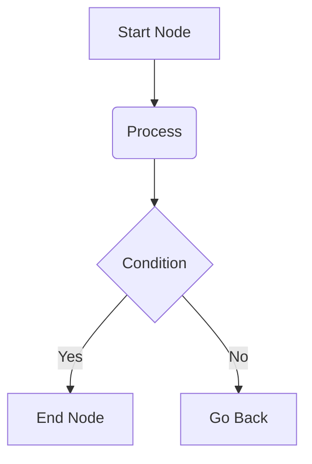

# FFM Basic Syntax

If you are already familiar with basic Markdown, you have practically mastered 90% of FFM. This section will quickly walk you through the standard core syntaxes supported by FFM.

## Headings

In FFM, the only legal syntax for creating headings is the `#` symbol. The number of `#` symbols (1–6) corresponds to heading levels 1 through 6.

```markdown
# Heading 1

## Heading 2

### Heading 3

#### Heading 4

##### Heading 5

###### Heading 6
```

```quote
**Note**:

- The `#` must be at the very beginning of a line, and there **must be a space** immediately after it.
- FFM does not support the old-style Setext headings where `===` or `---` is placed on the line below the text.
```

## Text Emphasis

To make text **bold**, wrap it in two asterisks:

```markdown
This is **bold text**.
```

To make text *italic*, wrap it in a single asterisk:

```markdown
This is *italic text*.
```

To make text ***bold and italic***, wrap it in three asterisks:

```markdown
This is ***bold and italic text***.
```

To apply --strikethrough--, wrap the text with two hyphens `--`:

```markdown
This is --deleted content--.
```

To underline text (typically for emphasis or a conclusive statement), wrap it with two underscores `__`:

```markdown
This is __underlined content, usually representing a conclusive statement__.
```

## Lists

FFM supports both unordered and ordered lists. For unordered lists, it is recommended to consistently use the `-` symbol. Create sub-lists by indenting with 2 spaces:

```markdown
- First item
  - Nested sub-item 1
    - Third-level item
    - Third-level item
  - Nested sub-item 2
- Second item
- Third item
```

For ordered lists, start directly with a number followed by a **half-width** period `.`. Use 4 spaces for nesting:

```markdown
1. First item
    - Nested unordered item 1
        - Third-level item
2. Second item
3. Third item
```

## Links and Images

Inserting links and images is very intuitive; the syntax for an image merely adds a `!` before the link syntax.

```markdown
Welcome to [Ф social](https://www.fuyeor.com).


```

```quote
**Note**: Due to security concerns, not all platforms support image embedding.
```

## Blockquotes

When you need to quote someone or highlight a particular explanation, use the `>` symbol:

```markdown
> "To be, or not to be, that is the question."
```

For multi-line quotes (3 lines or more), it is recommended to wrap the content inside ` ```quote `:

````markdown
```quote
"To be, or not to be, that is the question."

— *Hamlet*
```
````

## Code

Representing code in Markdown usually falls into two categories: inline code and code blocks.

### Inline Code

For inline code, wrap the text with backticks `` ` ``, for example:

```markdown
The way to declare a constant in JavaScript is: `const name = "Fuyeor"`
```

If the inline code itself contains a backtick, use two backticks to wrap it, for example:

```markdown
The way to declare a constant in Fer is: `` name = `Fuyeor` ``
```

### Code Blocks

Use three backticks ` ``` ` to denote a code block. It is recommended to specify the language name right after the opening backticks for perfect syntax highlighting upon rendering:

````markdown
You can declare a function in TypeScript like this:

```typescript
function sayHello() {
  console.log('Hello, Fuyeor!');
}
```
````

Code blocks can be nested. If you need to represent a code block within a code block, use a higher number of backticks for the outer layer:

`````markdown
Create an accordion in FFM using the following syntax:

````markdown
```accordion
**Title or Step**

Paragraph content
```
````
`````

## Other FFM-specific Syntaxes

FFM currently supports the `slide`, `chain`, and `accordion` syntaxes. All of them are wrapped in fenced code blocks.

### slide

`slide` is recommended for items of similar length that are meant for side-by-side comparison. It uses the horizontal rule syntax `---` to separate blocks:

````markdown
Below is a comparison of various social media platforms:

```slide
**Ф social**
- Character limit: 3000–5000 (characters)
- Content format: Fuyeor Flavored Markdown

---

**Bluesky**
- Character limit: 300 (characters)
- Content format: Plain text

---

**Mastodon**
- Character limit: Varies per instance, but defaults to 500 on most instances
- Content format: Plain text
```
````

> **Note**: There must be line breaks before and after `---`.

### chain

`chain` (thought chain) is recommended for scenarios such as FAQs, thought processes, timelines, task lists, and tutorial steps.

It uses a line of bold syntax (`**`) on its own to create a heading node. Here is an example used as a timeline:

````markdown
The internet evolved from a military experimental network to global connectivity and the participatory information age through the following stages:

```chain
**1960s: Concept and Prototype**
The U.S. Department of Defense proposed the "ARPANET" concept, aiming to build a decentralized network that could still communicate even if some nodes were destroyed.

**1970s–1980s: Laying the Technical Foundation**
The TCP/IP protocol suite was born, establishing a universal language for computers to talk to each other, gradually forming the prototype of the internet.

**1990s: The World Wide Web and Popularization**
The emergence of the World Wide Web (WWW) made web pages browsable. The internet officially opened to the public, entering an era of large-scale commercialization and mass adoption.

**2000s–2010s: Flourishing Growth**
Forums, blogs, and social media boomed. The widespread adoption of smartphones truly put the internet in people’s pockets, enabling access anytime, anywhere.

**Present: Intelligent Interconnection**
We have fully entered an era deeply integrated with mobile internet, the Internet of Things, big data, and artificial intelligence.
```
````

Inside the headings, Markdown task list syntax is supported. For example:

- `**[x] Title**` renders as a completed heading style (usually a green node)
- `**[ ] Title**` renders as an incomplete heading style (usually a yellow node)
- `**Title**` renders as the default style (usually a purple node)

The following is an example used as a task list:

````markdown
Progress of the preparations for a friend’s weekend birthday party:

```chain
**[x] Step 1: Book the party venue**
We have already reserved the board game place that everyone agreed on, and paid the deposit.

**[x] Step 2: Confirm the final headcount**
Everyone has signed up in the group chat, and a total of 8 people will attend.

**[ ] Step 3: Buy snacks and drinks**
We've made a shopping list and plan to buy everything on Saturday morning and bring it directly to the venue.

**[ ] Step 4: Prepare the mystery birthday gift**
The gift we ordered online is still on the way and is expected to arrive by Friday afternoon.
```
````

It is also very suitable for writing simple step-by-step guides. Here is an example used as a tutorial:

````markdown
How to brew yourself a delicious cup of drip coffee:

```chain
**Tear open the filter bag**
Carefully tear along the perforated line on the package, and hang the two paper "ears" firmly on the rim of the cup.

**First pour – blooming**
Gently wet the coffee grounds with hot water and let it sit for 20 seconds. You will smell a rich coffee aroma.

**Complete the pour in stages**
Continue to slowly pour hot water until the cup reaches your desired strength, then remove the filter bag and discard it.
```
````

### accordion

`accordion` is recommended for scenarios such as Frequently Asked Questions (FAQ), hiding detailed content to save space, "click to reveal the answer," or behind-the-scenes tidbits.

> The name "accordion" comes from a vivid analogy in web design: just like the bellows of an accordion can freely expand and collapse, this component allows content to be freely expanded and collapsed, thus keeping the page clean and tidy.

It uses the same syntax as `chain`, the differences being that **accordion content is collapsed and hidden by default** (users must click the heading to expand it), and it **does not** support the Markdown task list syntax (meaning you cannot use `[x]` or `[ ]` to change colors).

Here is an example used as a Frequently Asked Questions (FAQ) section:

````markdown
Some common questions about our community:

```accordion
**How can I join your volunteer team?**
Click "Join Us" in the upper-right corner of the homepage, fill out a simple application form, and our admin will contact you within three working days.

**Do I need to bring my own tools for the event?**
No, you don't. All the materials and tools needed for each activity will be provided for free on site.

**What if something comes up and I can't make it?**
That's okay. Just click "Cancel Reservation" in your personal center at least 24 hours before the event starts.
```
````

Here is an example used to hide detailed steps:

````markdown
Today we'll teach you how to make the classic dish "Scrambled Eggs with Tomatoes." Click the headings to view the specific steps:

```accordion
**Step 1: Prepare the ingredients**
Wash 2 tomatoes and cut them into wedges. Crack 3 eggs into a bowl, add a pinch of salt, and beat until combined.

**Step 2: Cook on the stove**
Heat oil in a wok. First, scramble the egg mixture until just set and remove. Then, sauté the tomatoes until they release their juices, and finally add the eggs back in and mix well.
```
````

```quote
**Formatting tips**:
- Within the content area of `chain` and `accordion`, it is not recommended to use `#` heading syntax.
- Both `chain` and `accordion` use a standalone single line of `**` as the heading node; therefore, the body text should not contain standalone bold lines.
- If a code block appears inside the content area of a `chain` or `accordion`, follow the code block nesting rules and use a higher number of backticks for the outermost layer, e.g., ``` ```chain ```.
```

## Advanced Rendering and Extensions

The following are Markdown extension syntaxes generally supported by FFM. They are not original FFM inventions but universal industry standards; FFM natively integrates their rendering engines.

### Mathematical Formulas (LaTeX)

LaTeX is a typesetting system widely used for composing complex mathematical formulas.

#### Inline Formulas

You can embed inline LaTeX formulas within paragraph content using a single `$` symbol. For example:

```markdown
The total number of atoms in the observable universe can be approximately expressed as $10^{80}$.
```

#### Block-level Formulas

To display independent, complex equations, wrap them in double `$$` symbols. Block-level formulas occupy their own line and are centered on the page. For example:

```markdown
The quadratic formula for solving $ax^2 + bx + c = 0$ is:

$$x = \frac{-b \pm \sqrt{b^2 - 4ac}}{2a}$$
```

```quote
According to LaTeX specifications, the `$` symbols wrapping the formula **should not contain spaces** inside.

- Correct: `$1+1=2$`
- Incorrect: `$ 1+1=2 $`

Although some platforms provide backward compatibility, the version with spaces is not standard syntax and may cause formulas to break in other renderers.
```

For more detailed formula syntax, you can refer to the [LaTeX Mathematics guide on Wikibooks](https://en.wikibooks.org/wiki/LaTeX/Mathematics) or the [Overleaf tutorial on mathematical expressions](https://www.overleaf.com/learn/latex/Mathematical_expressions).

### Flowcharts and Diagrams (Mermaid)

Mermaid is a text-based diagram generation tool that allows you to create flowcharts, sequence diagrams, Gantt charts, and more using a syntax similar to Markdown.

You can learn its detailed syntax on the [Mermaid official website](https://mermaid.js.org/intro/), or describe your requirements to an AI in natural language to generate the corresponding diagram code.

When writing, use the `mermaid` keyword to declare the code block. Example:

````markdown

````

### Simplified Molecular-Input Line-Entry System (SMILES)

The Simplified Molecular-Input Line-Entry System (SMILES) is a specification for unambiguously describing the structure of a molecule using an ASCII string. It converts complex 2D or 3D chemical structures into a plain-text form that is easy to read and store, and is widely used in chemical database searching, molecular editing software, and cheminformatics.

You can learn its syntax specification in the [Daylight SMILES Theory Manual](https://www.daylight.com/dayhtml/doc/theory/theory.smiles.html) or the [OpenSMILES open standard](http://opensmiles.org/opensmiles.html), or describe it to an AI in natural language to generate the corresponding SMILES.

When writing, use the `smiles` keyword to declare the code block. Example:

````markdown
```smiles
c1ccccc1
```
````

> SMILES rendering is based on the [Fuyeor/chemistry](https://github.com/Fuyeor/chemistry) public API, which is built on RDKit.

### Music Notation (ABC)

ABC notation is a text-based specification for recording and typesetting music scores using plain text and ASCII characters.

For specific score and note syntax, refer to the [official ABC notation site](https://abcnotation.com).

When writing, use the `abc` keyword to declare the code block. Example:

````markdown
```abc
X: 1
T: Scale Example
M: 4/4
L: 1/4
K: C
C D E F | G A B c |
```
````
