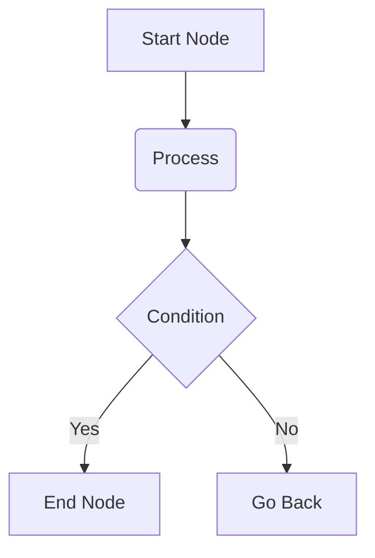

# Advanced Rendering and Extensions

The following are Markdown extension syntaxes generally supported by FFM. They are not original FFM inventions but universal industry standards; FFM natively integrates their rendering engines.

## Mathematical Formulas (LaTeX)

LaTeX is a typesetting system widely used for composing complex mathematical formulas.

### Inline Formulas

You can embed inline LaTeX formulas within paragraph content using a single `$` symbol. For example:

```ffm
The total number of atoms in the observable universe can be approximately expressed as $10^{80}$.
```

### Block-level Formulas

To display independent, complex equations, wrap them in double `$$` symbols. Block-level formulas occupy their own line and are centered on the page. For example:

```ffm
The quadratic formula for solving $ax^2 + bx + c = 0$ is:

$$x = \frac{-b \pm \sqrt{b^2 - 4ac}}{2a}$$
```

```quote
According to LaTeX specifications, the `$` symbols wrapping the formula **should not contain spaces** inside.

- Correct: `$1+1=2$`
- Incorrect: `$ 1+1=2 $`

Although some platforms provide backward compatibility, the version with spaces is not standard syntax and may cause formulas to break in other renderers.
```

For more detailed formula syntax, you can refer to the [LaTeX Mathematics guide on Wikibooks](https://en.wikibooks.org/wiki/LaTeX/Mathematics) or the [Overleaf tutorial on mathematical expressions](https://www.overleaf.com/learn/latex/Mathematical_expressions).

## Flowcharts and Diagrams (Mermaid)

Mermaid is a text‑based diagram generation tool that allows you to produce flowcharts, sequence diagrams, Gantt charts, and more using a Markdown‑like textual syntax. You can learn its detailed syntax at the [Mermaid official website](https://mermaid.js.org/intro/), or describe your requirements to an AI in natural language to generate the corresponding code.

When writing, use the `mermaid` keyword to declare a code block. Example:

````ffm

````

## Simplified Molecular‑Input Line‑Entry System (SMILES)

The Simplified Molecular‑Input Line‑Entry System (SMILES) is a specification for unambiguously describing molecular structures using ASCII strings. It transforms complex 2D or 3D chemical structures into plain text that is easy to read and store, widely used in chemical database searches, molecular editing software, and cheminformatics.

You can learn its syntax from the [Daylight SMILES Theory Manual](https://www.daylight.com/dayhtml/doc/theory/theory.smiles.html) or the [OpenSMILES specification](http://opensmiles.org/opensmiles.html), or describe your molecule to an AI in natural language to generate the corresponding SMILES.

In FFM, SMILES rendering is typically provided via the [Fuyeor/chemistry](https://github.com/Fuyeor/chemistry) public API, which wraps RDKit.

### Inline Display

To display SMILES inline, use the annotation syntax (`#[]`):

````ffm
```smiles
Speaking of pain relief, the structure of the most familiar aspirin is #[smiles = `CC(=O)OC1=CC=CC=C1C(=O)O`]; while its rival ibuprofen has the molecular formula #[smiles = `CC(C)CC1=CC=C(C=C1)C(C)C(=O)O`].
```
````

### Block‑level Display

To display independent images, use the `smiles` keyword to declare a code block. For multiple images, list one SMILES per line. Example:

````ffm
```smiles
CCO
c1ccccc1
```
````

## Music Notation (ABC)

ABC notation is a text-based specification for recording and typesetting music scores using plain text and ASCII characters.

For specific score and note syntax, refer to the [official ABC notation site](https://abcnotation.com).

When writing, use the `abc` keyword to declare the code block. Example:

````ffm
```abc
X: 1
T: Scale Example
M: 4/4
L: 1/4
K: C
C D E F | G A B c |
```
````
