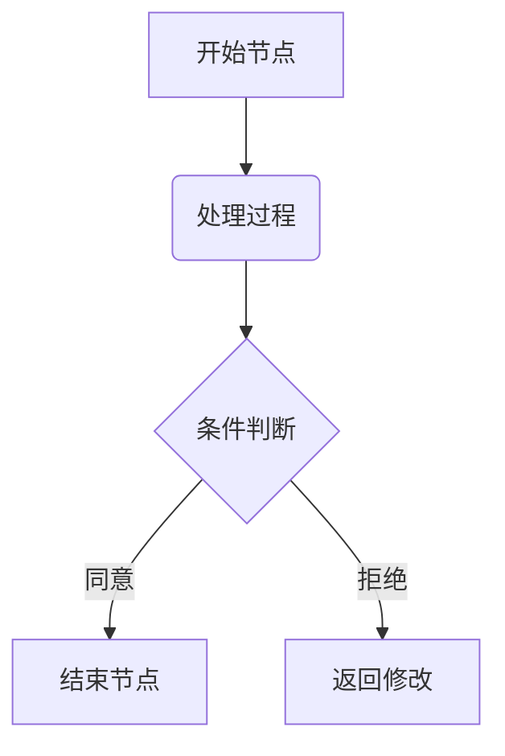

# 高级渲染与拓展

为更具表达力，FFM 支持部分 Markdown 扩展语法。它们本身并非 FFM 的原创语法，而是通用的行业标准，但 FFM 内置集成了其渲染引擎。

## 数学公式 (LaTeX)

LaTeX 是一种广泛用于排版复杂数学公式的文本排版系统。

### 行内公式

可以使用单个 `$` 符号在段落内容中嵌入行内 LaTeX 公式。例如：

```ffm
可观测宇宙中的原子总数大约可以表示为 $10^{80}$。
```

### 块级公式

如果需要展示独立、复杂的公式方程，可以使用双 `$$` 符号将其包裹。块级公式会独占一行，并在页面中居中显示。例如：

```ffm
一元二次方程 $ax^2 + bx + c = 0$ 的求根公式为：

$$x = \frac{-b \pm \sqrt{b^2 - 4ac}}{2a}$$
```

```quote
按照 LaTeX 规范，包裹公式的 `$` 符号内部**不应包含空格**。

- 正确示例：`$1+1=2$`
- 错误示例：`$ 1+1=2 $`

虽然部分平台提供了向下兼容，但带空格的写法并非标准语法，在其他渲染器中可能会导致公式失效。
```

更多详细的公式语法，可查阅 Wikibooks 的 [LaTeX 数学指南](https://zh.wikibooks.org/zh-hans/LaTeX/%E6%95%B0%E5%AD%A6%E5%85%AC%E5%BC%8F)，或 [Overleaf 数学表达式教程](https://cn.overleaf.com/learn/latex/Mathematical_expressions)。

## 流程图与图表 (Mermaid)

Mermaid 是一种基于文本的图表生成工具，允许使用类似于 Markdown 的文本语法来生成流程图、序列图、甘特图等。可以在 [Mermaid 官网](https://mermaid.js.org/intro/)学习其详细语法，或者使用自然语言向 AI 描述需求以生成对应的格式代码。

在编写时，请使用 `mermaid` 关键字声明代码块。示例如下：

````ffm

````

## 简化分子线性输入规范（SMILES）

简化分子线性输入规范（SMILES）是一种用 ASCII 字符串明确描述分子结构的规范。它将复杂的二维或三维化学结构转化为易于阅读和存储的纯文本形式，被广泛应用于化学数据库搜索、分子编辑软件及化学信息学中。

可以在 [Daylight SMILES 官方理论手册](https://www.daylight.com/dayhtml/doc/theory/theory.smiles.html)或 [OpenSMILES 开源标准](http://opensmiles.org/opensmiles.html)学习它的语法规范，或者使用自然语言向 AI 描述以生成对应的 SMILES。

在 FFM 中，SMILES 通常基于 RDKit 封装的 [Fuyeor/chemistry](https://github.com/Fuyeor/chemistry) 公共 API 渲染。

### 行内公式

如需在行内展示 SMILES，请使用注解语法（`#[]`）：

````ffm
```smiles
提到止痛，大家最熟悉的阿司匹林结构式为 #[smiles = `CC(=O)OC1=CC=CC=C1C(=O)O`]；而它的死对头布洛芬，分子式则是 #[smiles = `CC(C)CC1=CC=C(C=C1)C(C)C(=O)O`]。
```
````

### 块级公式

如果需要展示独立图片，请使用 `smiles` 关键字声明代码块。如果需要多张图片，请每行列出一个 SMILES。示例如下：

````ffm
```smiles
CCO
c1ccccc1
```
````

## 五线谱 (ABC)

ABC 记谱法（ABC notation）是一种用纯文本和 ASCII 字符来记录并排版音乐乐谱的文本规范。

具体的谱面和音符语法可参考 [ABC 音乐规范官方文档](https://abcnotation.com)。

在编写时，请使用 `abc` 关键字声明代码块。示例如下：

````ffm
```abc
X: 1
T: 示例乐曲 (Scale Example)
M: 4/4
L: 1/4
K: C
C D E F | G A B c |
```
````
